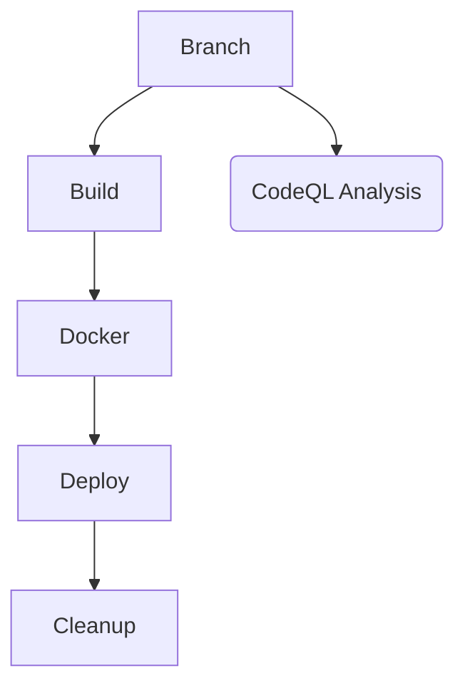
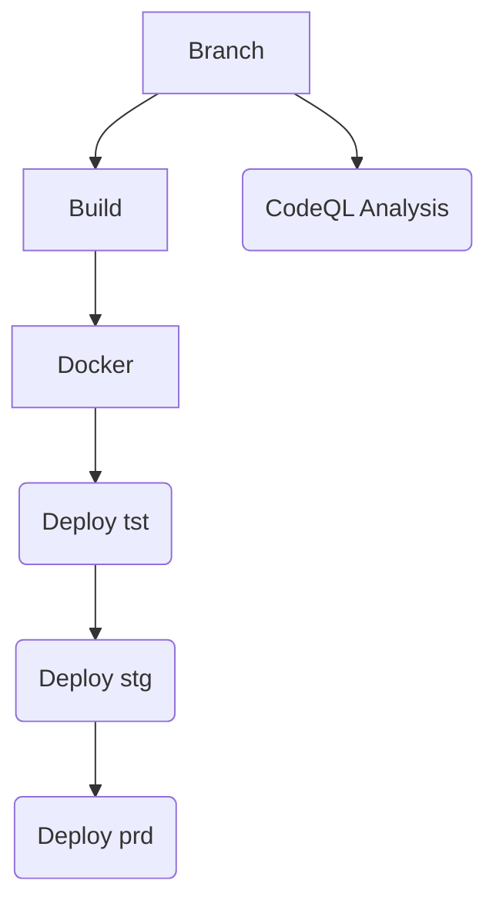

# Pipeline Demo App
The application is built to demo the ideal pipeline as per my thinking. The project follows [github flow](https://docs.github.com/en/get-started/quickstart/github-flow). The pipeline is created using the github actions reusable workflows. The [reusable workflow](https://docs.github.com/en/actions/using-workflows/reusing-workflows) allows us to created different workflows without repeating the code. The reusable workflow also allows us to replace a sub flow of the main workflow easily e.g. changing the cloud service provider here will require only changing the deploy and clean reusable workflows while the build, docker and analysis can stay as it is.
 
 It is containing two main workflows
1. Pull Request - Triggers on when a PR is created against main branch
2. Continuous Integrations and Deployment - Triggers on when a PR is merged into the main branch

## Reusable Workflow Details
#### 1. Build.yml
- The workflow is responsible for the following steps:
   - checkout the branch
   - setting up tools required for build and cache such as nuget
   - build
   - running automated tests
   - publishing test coverage
   - creating artifacts

- Inputs required for Workflow
   - solution_path - Path of project for the restore
   - coverage_info_file_path - The file path containing the automated test coverage
   - artifacts_file_path - Path for the files/directory that will be included into the artifacts
   - [secret]code_coverage_token - A token that will be used to push the code-coverage to coverall

- Input optional for workflow
   - dotnet_versiosns - A matrix param for dotnet versions in case the projects should be build against multiple dotnet versions
     **Default**: 6.0.x
   - include_code_coverage - A boolean flag which will indicate weather the code coverage is required for the project or not.
     **Default**: true
   - upload_artifacts - A boolean flag which will indicate weather the workflow should created artifacts or not.
     **Default**: true

#### 2. CodeQL.yml
- The workflow is responsible for the following steps:
   - checkout the branch
   - Initializing for the codeql analysis
   - build for the codeql analysis
   - perform codeql analysis

- Inputs required for Workflow
   - config_file_path - A path where the codeql config file stored

- Input optional for workflow
   - languages - A matrix param for languages that is used for the codeql analysis
     **Default**: csharp

#### 3. Docker.yml
- The workflow is responsible for the steps related to docker push which are as following steps:
   - docker caching
   - docker login
   - docker build
   - docker push
   
- Inputs required for Workflow
   - docker_file_directory - Path of the docker file used for building the image
   - docker_image_tag - The tag used for the docker image
   - docker_repository_name - Name of the docker repository where the images will be sent to
   - [secret]docker_login_username - Username for the docker registry login
   - [secret]docker_login_password - Password/Access Token for the docker registry login

#### 4. Deploy.yml
- The workflow is responsible for the following steps:
   - downloading the build artifacts
   - azure login
   - creating resource if not exists
   - deploy bicep/arm template (creating asp and webapp)
   - deploy image to webapp

- Inputs required for Workflow
   - resource_group_name - Name of the resource group where the resources will be created
   - bicep_parameters - Parameters/File required for the bicep deployment template
   - webapp_name - Name of the webapp where the image will be deployed
   - docker_image_tag - The tag used for the docker image (same tag as build)
   - docker_repository_name - Name of the docker repository where the images from build job are be sent to
   - region - Name of the region where the resources are created
   - [secret]azure_credentials - Azure service principal credentials used for the Azure login
   - [secret]subscription_id - Subscription Id for all the resources
   - [secret]docker_login_username - Username for the docker registry login
   - [secret]docker_login_password - Password/Access Token for the docker registry login

- Input optional for workflow
   - bicep_file_path - A path containing the resource deployment file. Resources such as app service plan, webapp
     **Default**: ./buildArtifacts/main.bicep

#### 5. Cleanup.yml
- The workflow is responsible for the following steps:
   - azure login
   - deleting resource group if not exists

- Inputs required for Workflow
   - resource_group_name - Name of the resource group which should be deleted and where the resources are be created
   - [secret]azure_credentials - Azure service principal credentials used for the Azure login
   
- Github environment associated
   - Cleanup - Environment responsible to make the workflow wait for 15 mins and start the clean up job as part of the whole flow

## Main workflows
#### 1. Pull Request (PR)
The workflow uses the build, analysis, docker, deploy and clean up reusable workflows. The workflow will be triggered when a pr is created against the `main` branch. It will do the validation for the by building and running the automated tests, building the docker image required for the resources, temporary resources for the dev testing and clean up.

#### 2. Continuous Integration and Deployment (CI)
     The workflow uses the build, analysis, docker and deploy reusable workflows. The workflow will be triggered when a pr is merged against the `main` branch. It will do the validation for the by building and running the automated tests, building the docker image required for the resources and deploy the resources with the correct image into different regions

## Notes
- For the demo purposes, there is only one environment for the PR validation. In real scenario, the environments can be created per pr using the branch name or sha
- To make development faster, the main workflows contains some hard code string. The major reason for this hard coded string is because the [limitations](https://github.community/t/reusable-workflow-env-context-not-available-in-jobs-job-id-with/206111) for reusable workflow. The reusable workflows do not have access to any env set on the workflow level.
  As per the [thread](https://github.community/t/reusable-workflow-env-context-not-available-in-jobs-job-id-with/206111), there is a workaround available which will be done in the future to share the variables between jobs and reduce the duplications
- For the demo purposes, the clean up job only waits for 15 mins as we are using the github environments. It also allows us to start the job on a review. There is also an option to run the clean up job on the PR merge.
- For the demo purposes, only clean up environment has been created. In real scenario, tst, stg and prod will have their own environments so the deployments are approved by correct reviewers

## Future work
- Making Pull request workflow more generic
- Reduce the hard coding from the both main workflows using the outputs
- Update clean workflow so can be triggered on merge to reduce the manual work
- Create CodeQL reduce the analysis workflow time
- Create github environments for each CI stage
- Find way to use script instead on inline script for azure cli